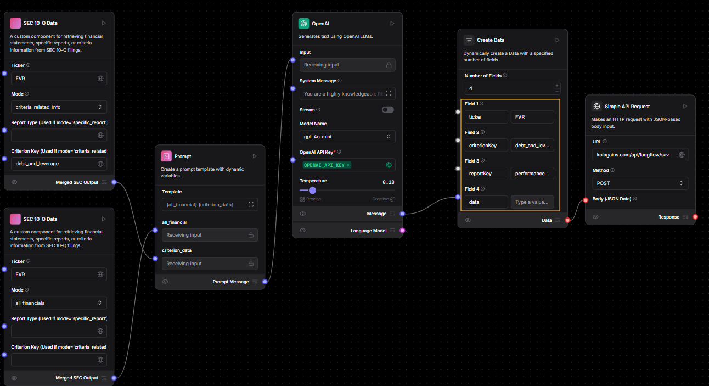

# How to Generate the Performance Checklist for Your Desired Company

To create a performance checklist for a specific company, you must first ensure that the appropriate **evaluation criteria** for the company's **industry group** already exist. If not, follow the steps in the [Criteria Setup Guide](./creating_first_report_criteria.md) before proceeding.

## Step 1: Build the LangFlow for Checklist Generation



- Build the flow in LangFlow just like you would when generating a full report.
- After the **OpenAI** component, use **"performanceChecklist"** as the `reportType`.
- Make sure to **carefully fill in all the fields** highlighted in yellow in the image above. These fields are necessary for saving the checklist correctly.
- Once ready, send a **POST** request to:  
  👉 `https://koalagains.com/api/langflow/save-performance-checklist`

## Step 2: Writing the Prompt for the Checklist

When creating a performance checklist for the **first time**, you’ll need to use a carefully crafted **prompt**. Below is an example prompt for the **"Stock Types"** criterion under the **REITs** industry group. You should **customize this prompt** based on the criterion you are working with.

### Example Prompt (for Stock Types under REITs):

```
Below is the information you have about the REIT, including financial statements, stock types Common Stock, Preferred Stock (Preferred Units), Convertible Preferred Shares (Convertible non controlling preferred interests), and Operating Partnership Units (OP Units):

{data}

Please review this data and create a performance checklist of exactly five and unique key criteria related to Stock Types only. Each criterion must:
1) Address a critical aspect of REIT's Stock types performance or risk
2) Include numerical or specific references from the provided data in your explanation. never use par value as  reference.
3) Assign a score of 0 or 1 with clear logic on why it passes or fails.

Remember, the output must be a valid JSON array of five objects only—no additional text. Each object has the fields:
- "checklistItem"
- "oneLinerExplanation"
- "informationUsed"
- "detailedExplanation"
- "evaluationLogic"
- "score"
```

### Step 3: Setting the Prompt Inside the OpenAI Component

Once the initial data is processed, you'll need to set the final prompt for the OpenAI component that actually generates the checklist:

#### Final Prompt Template:

```
You are a highly knowledgeable REIT performance analyst. Your role is to evaluate the provided financial statements and stock types data to create five key performance criteria for assessing this REIT’s health and risk. Each checklist item must be scored 0 or 1 based on whether the REIT meets the criterion, with clear reasoning. Return the results only as a JSON list of 5 objects.

Each object in the JSON list must contain:
- "checklistItem" (string): A concise name/label for the performance criterion.
- "oneLinerExplanation" (string): A brief 1-line summary of why it matters.
- "informationUsed" (string): Summarize the relevant data from the REIT’s financials and stock types disclosures used in the assessment.
- "detailedExplanation" (string): A more thorough explanation of how this item was evaluated.
- "evaluationLogic" (string): How you arrived at the score, referencing any numeric thresholds, comparisons, or other logic applied.
- "score" (integer): 1 if the criterion is met, 0 if not met.

Do not include any additional commentary or text outside the JSON list. Output only the JSON array of 5 objects.
```

> ⚠️ These prompts are specific to **REITs** and the **Stock Types** criterion. Be sure to **modify the content and wording** as needed to match the industry group and criterion you are working with.
