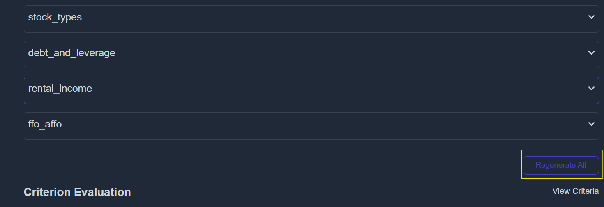
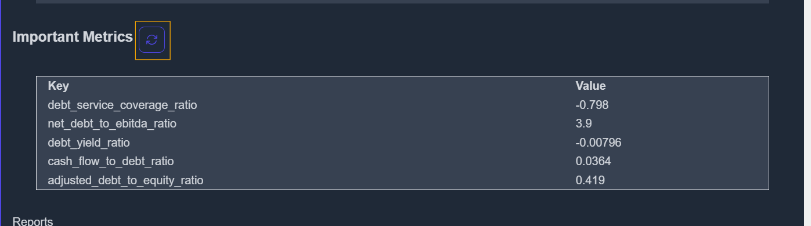

# How to Regenerate Criteria Matching, Criterions, and Specific Reports

If you're not already logged in as an admin, please complete the steps outlined in the [Authentication Guide](./authentication.md) before proceeding.

To manage or regenerate any report-related data, go to the **Debug Page**:  
👉 [https://koalagains.com/public-equities/debug/ticker-reports/FVR](https://koalagains.com/public-equities/debug/ticker-reports/FVR)

> _(Replace `FVR` with the ticker symbol of the company you are working on.)_

## Regenerate Criteria Matching

If the evaluation criteria are not aligning correctly with the SEC data, you can regenerate the **criteria matching** by clicking the button shown below:

This process ensures that your matching instructions are re-applied and up to date.

## Regenerate All Criterions

To regenerate **all criteria** for the company at once:

- Click the **"Regenerate All Criterions"** button as shown below.

This will refresh all AI-generated content related to each evaluation criterion.

## Regenerate a Specific Criterion

To regenerate a **single criterion**:

1. Paste the **AI Agent Webhook URL** into the input box.
2. Click **Save** to confirm the webhook URL.
3. Click the **Regenerate** button for that specific criterion.

## Regenerate Performance Checklist

To refresh the **performance checklist** for a specific criterion:

1. Click on the **encircled arrow** as shown:

2. Then, click the checklist regeneration button:

## Regenerate Important Metrics

To regenerate **important metrics**:

1. Click on the encircled arrow under the relevant criterion:

2. Click the button shown below to regenerate the metrics:

## Regenerate Specific Report

To regenerate a **specific text or chart report** for a given criterion:

1. Again, click the encircled arrow:

2. Then, click the specific report regeneration button:

This will trigger a fresh generation of the selected report using the latest data and AI logic.
