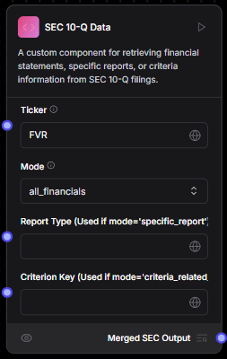
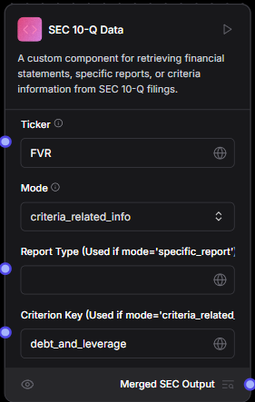
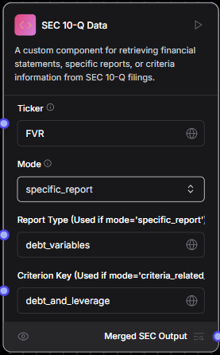
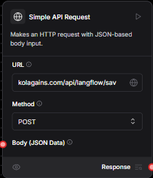

# Dodao Custom Langflow Tools

## SEC 10Q Data Tool

- This tool is custom tool made by us to extract the important information from the SEC 10 Q report.
- The information it can extract includes financial statements, criteria related information,specific reports etc

  

## Modes

### All Financials

- In this mode the tool extracts all the financial statements for the ticker provided and the mode set as "all_financials" as shown in image above

### Criteria Related Info

- In this mode the tool extracts the specified criteria related info for the ticker provided and the mode set as "criteria_related_info" and also the criterion key set
  

### Specific Report

- In this mode the tool extracts the specified criteria related info for the ticker provided and the mode set as "specific_report" and also the criterion key set along with the Report Type set
  

## Simple API request Tool

This Tool is to send the API request and it has two fileds

- The URL field where the api endpoint of KoalaGains will be entered
- The second is method for the request
- Also the json body can be passed

