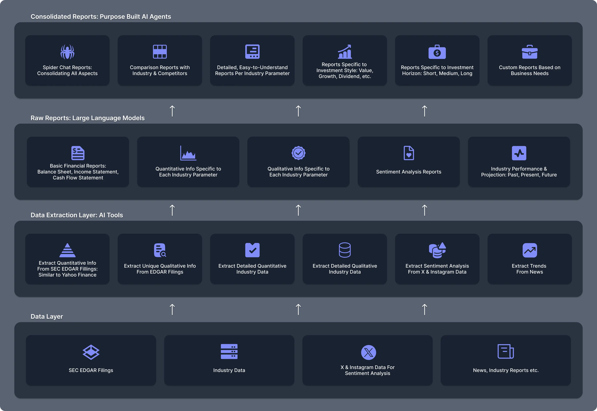

# Vision
Making investment decisions requires good amount of information which is presented in a way that is easy to understand,
but is also specific to investment category/industry/sub-industry.

The specific information is not available in the market right now. Creating such information using conventional methods
used to be very expensive, but with the advent of AI, it is now possible to create such information at a fraction of the cost.

AI helps us to move at least 20x faster. The product we have built/building was not possible without AI. We can now
compete with the best known investment related information websites.

We are building a platform that will provide raw data, quantitative and qualitative information on each of the
factor that can affect the performance and valuation of a company. The platform will also keep track of
current events, and trends in the industry. Along with this the platform will keep track of sentiment analysis
of various topics, keywords, products, sectors, and companies.

# Architecture

### Data Layer
At the bottom is the raw data layer. This layer will have all the raw data that is required to derive the information.

This consists of
- SEC EDGAR Filings
- Industry Data
- X and Instagram Data for sentiment analysis
- News, Industry Reports, etc.

### Data Extraction Layer
This consists of the tools that will extract the data from the raw data layer and will provide it to LLM. Analysts can
then use the LLM/Agent with the specific tools to create meaningful information.

This consists of
- Extract qualitative information from SEC EDGAR filings (Similar to yahoo finance)
- Extract qualitative information from SEC EDGAR filings (Not present anywhere else currently)
- Extract detailed quantitative information specific to industry (Not present else currently)
- Extract detailed qualitative information specific to industry (Not present else currently)
- Extract sentiment analysis from X and Instagram data
- Extract sentiment analysis from SEC EDGAR filings

### RAW Reports / Pivoted Reports
Many times the tools need to be run on processed data. This layer will have the processed data that is required by some
of the tools.

This consists of
- Raw basic financial reports(balance sheet, income statement, cash flow statement)
- Quantitative information specific to each criterion specific to industry
- Qualitative information specific to each criterion specific to industry
- Sentiment analysis reports
- Industry performance and projections - Past, Present, Future

### LLM/Agent Layer
This is the layer where analysts can write the agents and create the reports. 

This consists of
- Spider chat reports consolidating all aspects of the company
- Comparison reports with industry and competitors
- Detailed easy to understand reports for each criterion specific to industry
- Reports specific to investment style (Value, Growth, Dividend, etc.)
- Reports specific to investment horizon (Short, Medium, Long)
- Custom reports based on needs of the business

