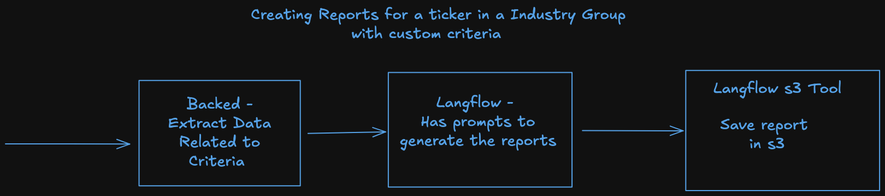

# Reports for Each Ticker

# Overview
This diagrams shows the flow of generating reports for a ticker. The flow is divided into 3 parts:

# Details

The report will be generated for each ticker. See [002_z05_z05_paths_and_json_structures.md](./002_z05_z05_paths_and_json_structures.md) for the paths and the structures.

The report will contain the following information:

Few things to note:
- Many times a single company can belong to multiple sectors, industry groups, industries, and sub-industries. For example tesla, google, etc.
- For now we will only focus on evaluating the company based on a single sub-industry. But in the schema, we are keeping that provision.

See [002_z05_z07_sample_report_json.md](./002_z05_z07_sample_report_json.md) for the sample report json.

# Criterion Reports
For crowdfunding we just had a single report for each criterion. But for public equities, we can have multiple 
reports for each criterion.

For example this page - https://koalagains.com/crowd-funding/projects/nightware/reports/traction shows the report
for the criterion `traction`. 

There is just text on this page. But we would want to have charts etc, and for this reason we have added the `outputType` field.

Then we can have a UI Component that can show the report based on the `outputType` field.

### Text Reports
We can have a simple MarkdownReportViewer component that can show the text report.

### Barchart/Piechart Reports
We can have a BarChartReportViewer component that can show the bar chart.

We can have a PieChartReportViewer component that can show the pie chart.

It will be the responsibility of the prompt to make sure the report generated is in the correct format. They can
just use a structured output.

# Report Generation Logic/Process/Code

We would want to write this part in Langflow. The reasons for writing this in Langflow are:
1. We need to have at-least 25 agents if we write custom criteria for each industry group. This will be a lot of code to write.
2. Langflow allows any non-technical person to write the agent
3. Non-devs can use the tools, and keep updating the prompts to make sure a right report is generated.
4. We can hire interns in Summer to cover 5-10 Industry Groups. They can write the prompts for the agents.

# Process

The process will be divided into 3 parts:
1. Backend - See [002_z05_z03_backend.md](./002_z05_z03_backend.md)
2. Langflow - See [002_z05_z03_langflow_agent.md](./002_z05_z03_langflow_agent.md)
3. Saving the Report - See [002_z05_z03_save_report.md](./002_z05_z03_save_report.md)

# Debug Page
We can have a debug page where we can see the information that we produce or the middle steps. This can be useful for debugging.

See [002_z05_z04_ticker_debug_page.md](./002_z05_z04_ticker_debug_page.md)

# Langflow Tools
We will have these tools in Langflow
1. SEC Edgar Extractor - This will extract the information from the latest 10Q - Already Done
2. Test Data Tool - This tool can allow for pulling test data from some url/github etc. This is just for testing purposes.
   - This will decouple the logic of extraction of data from the logic of generating the report. 
   - The person generating the report can just assume the test data tool to get the right data.
   - Also we dont need to invoke LLM every time to get the data as we work on optimizing the prompts for report generation.
   - For example we need to have data for criterion `debt` when evaluating REITs. Now either we invoke the SEC Edgar Extractor again and again, or just use the test data tool.
   - The tool can have two dropdowns - 1. Ticker 2. Criterion. And then it can return the data for that criterion for that ticker.
