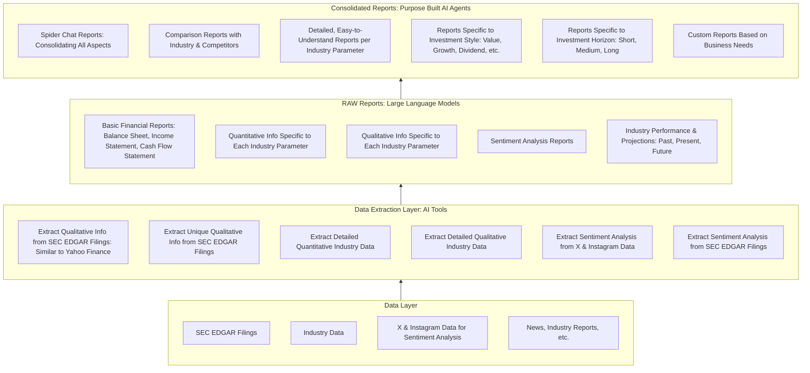

# Architecture

## Layers
#### Bottom Layer: **Data Layer**
- SEC EDGAR Filings
- Industry Data
- X and Instagram Data for sentiment analysis
- News, Industry Reports, etc. 

#### Data Extraction Layer - AI Tools
- Extract qualitative information from SEC EDGAR filings (Similar to yahoo finance)
- Extract qualitative information from SEC EDGAR filings (Not present anywhere else currently)
- Extract detailed quantitative information specific to industry (Not present else currently)
- Extract detailed qualitative information specific to industry (Not present else currently)
- Extract sentiment analysis from X and Instagram data
- Extract sentiment analysis from SEC EDGAR filings

#### RAW Reports  - Using Large Language Models
- Raw basic financial reports(balance sheet, income statement, cash flow statement)
- Quantitative information specific to each parameter specific to industry
- Qualitative information specific to each parameter specific to industry
- Sentiment analysis reports
- Industry performance and projections - Past, Present, Future

#### Consolidated Reports - Using Purpose Built AI Agents
- Spider chat reports consolidating all aspects of the company
- Comparison reports with industry and competitors
- Detailed easy to understand reports for each parameter specific to industry
- Reports specific to investment style (Value, Growth, Dividend, etc.)
- Reports specific to investment horizon (Short, Medium, Long)
- Custom reports based on needs of the business

