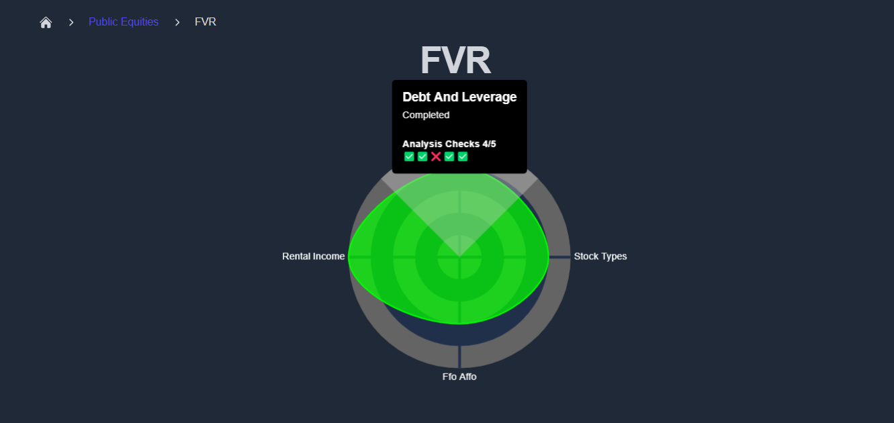
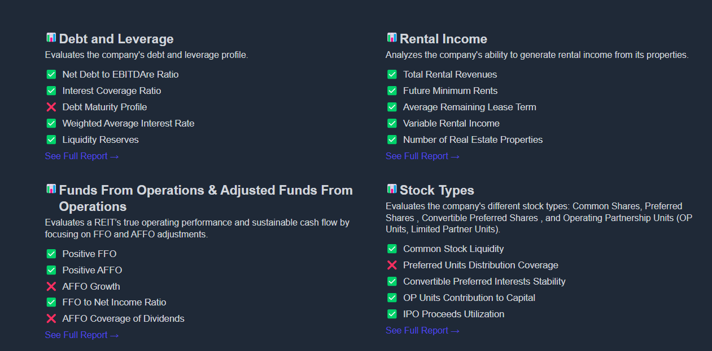

# Viewing Your Report in KoalaGains

After successfully generating and saving your report, you can view it directly on the KoalaGains platform.

## Report Summary

Each company report includes a **spider chart** that visually summarizes how the company performed across all selected evaluation criteria. These scores are based on the **performance checklist**, which measures specific indicators for each criterion.

In addition to the scores, KoalaGains provides **detailed breakdowns** for every criterion. These reports explain the logic and data used to assign each rating.

## How to Access Your Company’s Report

To view the full report for a company, go to:  
👉 [https://koalagains.com/public-equities/tickers/FVR](https://koalagains.com/public-equities/tickers/FVR)

> _(Replace `FVR` with the actual ticker of your company.)_

On this page, you’ll see a list of all reports generated for the selected company:

Find the report that matches your chosen criterion—for example, **Debt and Leverage**.

## Opening a Full Report

Click on **“See Full Report”** to view the detailed content. This includes:

- A written explanation of the criterion
- Visual charts and key metrics
- Scores from the performance checklist
- AI-generated insights based on SEC data

You can also access the report directly using a URL like this:  
👉 [https://koalagains.com/public-equities/tickers/FVR/criteria/debt_and_leverage](https://koalagains.com/public-equities/tickers/FVR/criteria/debt_and_leverage)

## Report Examples

Here are some examples of what a full report may look like:

  
  
  

These views combine text and visuals to give you a clear, structured overview of how the company is performing according to your selected evaluation criteria.
