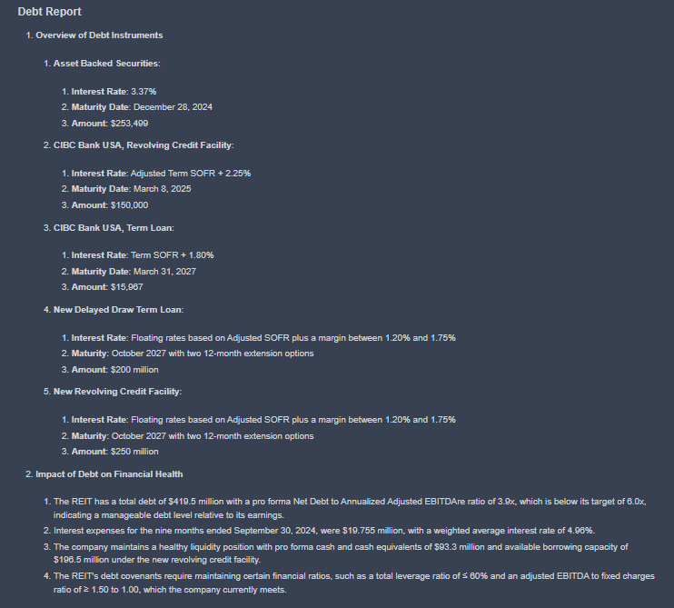

## Seeing your report in Koalagains

The full company report includes a spider chart that summarizes the criteria and scores based on performance checklist. The criterion is not just scored but also has detailed reports explaining the reasons behind each rating.

You can go to https://koalagains.com/public-equities/tickers/FVR where you will see

Now find your's report here e.g "debt_and_leverage"

You can click on "See Full Report" to view and read the detailed report, similar to the one shown in the image. You can also use https://koalagains.com/public-equities/tickers/FVR/criteria/debt_and_leverage to read the detailed report.

