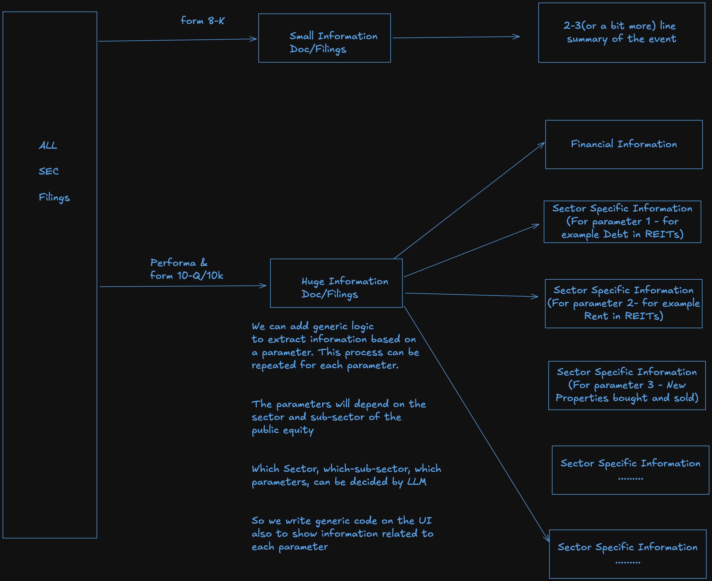

# Extracting Information from Long SEC Filings

Extracting of the information from Long Text is explain [here](./004_z01_collecting_info_from_pdf.md).

When processing long filings/text, we need to know which parameters on which we need to process the text. 

# Process of know important parameters or categories 
- For a REIT debt plays a very important role, so we need to extract all the information related to debt . The Number of 
properties owned by the REIT and number of clients who are renting the properties etc.
- For an airline company, the number of planes, the number of routes, the number of passengers, the number of employees, etc.
- For a bank, the number of branches, the number of employees, the number of customers, the number of loans, the number of deposits, etc.
- For a software company, ....... are important parameters
- For a ..... company, ....... are important parameters

We can ask the LLM for the exact sector and sub-sector of the company, and then ask for the most important parameters 
for that sector. 

This allows us to create a very generic layer for processing of SEC information and showing it to the user.

See more details here in this image

