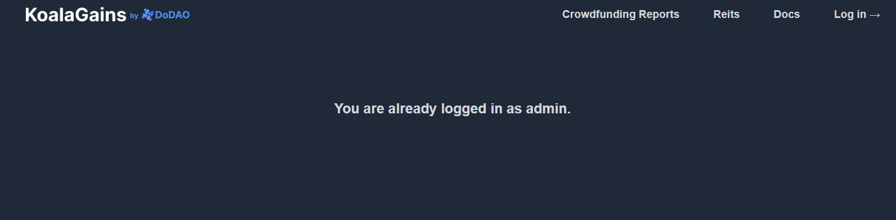

# How to authencticate as an admin

## Step1 : Go to the Authentication Page

- Go to authentication Page:

  - https://koalagains.com/authenticate
  - Following screen will show up

  

## Step 2 : Get the Admin Code and Enter it

- Now get your admin code from Robin and enter it
- Now click on Authenticate and you will see the folllowing screen

  

- Now you are Logged in as an admin and can perform all the edit and create functions
