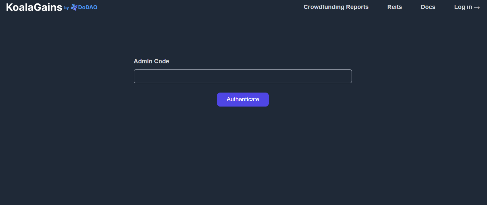

# How to Authenticate as an Admin

To access admin features on the KoalaGains platform—such as creating or editing evaluation criteria—you’ll need to authenticate yourself using a valid admin code. This section will guide you through the steps to log in as an admin.

## Step 1: Visit the Authentication Page

Start by opening the authentication page in your browser:

👉 [https://koalagains.com/authenticate](https://koalagains.com/authenticate)

You’ll see the following screen:

## Step 2: Enter Your Admin Code

- Obtain your **admin code** from **Robin** (or the relevant administrator).
- Enter the code in the provided field and click the **"Authenticate"** button.

After successful authentication, the following screen will appear:

Once logged in, you’ll have admin access and can perform actions such as:

- Creating new evaluation criteria
- Editing existing ones
- Managing reports and configurations

This access gives you full control over the evaluation process within the platform.
