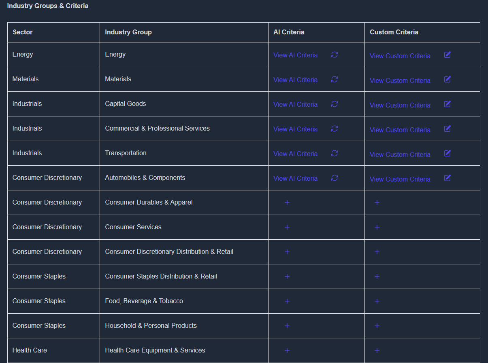
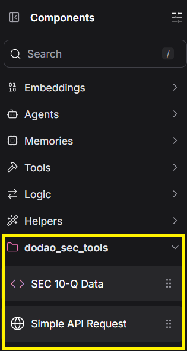
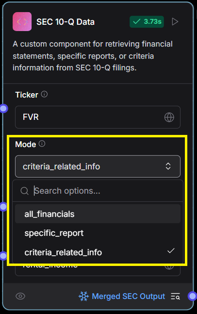

# How to Generate the report for your desired company

If you are not looged in as admin then go to [Authentication](./authentication.md)

## Step 1: Locate the sector and the industry group your company falls in

- If the criteria is already generated e.g if your company falls under | industries - transportation| proceed to step 5 else follow the steps below

## Step 2: Generating the criteria for your company industry group

- Click on AI criteria and then write “confirm” to start generating the AI criteria

- Criteria will be generated in a few minutes.

## Step 3: Customizing the AI generated criteria

- You may need to make changes to the ai generated criteria according to your needs.
- Click on the + sign under the “custom criteria” column once the AI content is generated
- (make change)

  

- The ai criteria will be copied and viewing it will show the following screen

  

- You can add an additional criterion to the ones created by AI by clicking on “Add criterion”
- You can edit the AI generated criterion by clicking on “edit” button under the actions column
- You can delete the AI generated criterion by clicking on “delete” button under the actions

  

- Once you made the changes, you need to set the “Matching Instruction” as well. This allows the AI to fetch information based on the criteria you explain here.

## Step 4: Saving the evaluation criteria

- After customizing the criteria, do not forget to save the changes or else the changes will be lost

  

## Step 5: Regenerating the evaluation criteria

- Headover to https://koalagains.com/public-equities/debug/ticker-reports/FVR and click “Regenerate Matching Criteria”

  

- Once the regeneration has been completed you can view the content generated by clicking on drop drown in front of each factor.
- If any changes are required go back to step 3

## Step 6: Setting up Langflow for report generation

- Headover to langflow
  https://www.langflow.org/

  

- Click on “Blank Flow” to start building the flow.

  

- On the left section (1) there is a list of components that will be used to build your flow
- On the right section (2) there is the canvas where you can drag and drop components

## Step 7: Generating the report

- Locate the dodao sec tools

  

- Build the flow

  

### Details of components

- Ticker contains the ticker of the company you are evaluating

- Criterion Key contains the name of the criterion. (use \_ instead of spaces)

- Mode lets you select the info you want to extract from the 10Q
- All_financials will fetch data of all financial statements
- Specific_report will fetch data of a particular financial statement
  Criteria_related_info will fetch the criteria related info.
