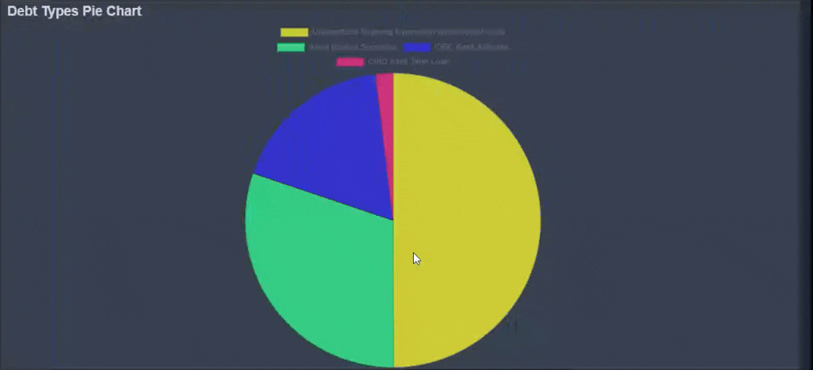

# Charts Reports

Along with the text reports KoalaGains also offer the chart reports . The charts may be of different types like Pie Charts, Spider Chart, Waterfall chart, Sankey Diagram, etc. These reports are there to tackle the need of showing the important numerical inforamtion for some criterion which has some comparison among different things like given in the image below the different types of debts and their Pie Chart

The Chart reports at KoalaGains are very important as they offer various benfits to the investors as follows:

- These charts show the complete picture of the feature being compared and the weightage of all the candidates in the chart
- These charts help the investor make the well informed decisons based on the graphical data
- These charts may be providing support to some text reports as well and vice versa
- These charts along with charts may also have the respective reports which have their detailed table providing the comprehensive view of the chart

