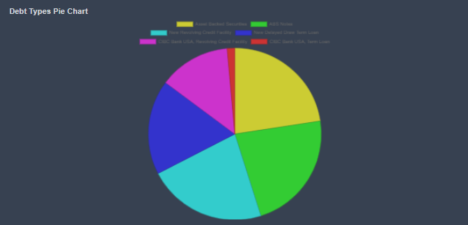

# Charts Reports

Along with the text reports koalagains also offer the chart reports . The charts maybe of different typpes leke bar chart or pie chart etc. These reports are their to tackle the need of showing the important numerical inforamtion for some criterion which has soe=me comparison among different things like given in the image below the different types of debts and their Pie Chart

The Chart reports at Koalagains are evry important as they offer various benfits to the investors as follows:

- These charts show he complete picture of the feature being compared and the weightage of all the candidates in the chart
- These charts help the investor make the well informed decisons based on the graphical data
- These charts may be providing support to some text reports a s well and vice versa
- These charts along withe chart s may also have the respective reports which have their detailed table providing the comprehensive view of the chart

