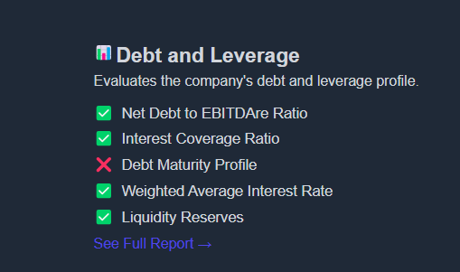
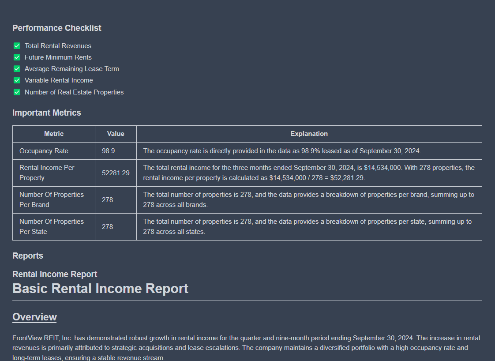
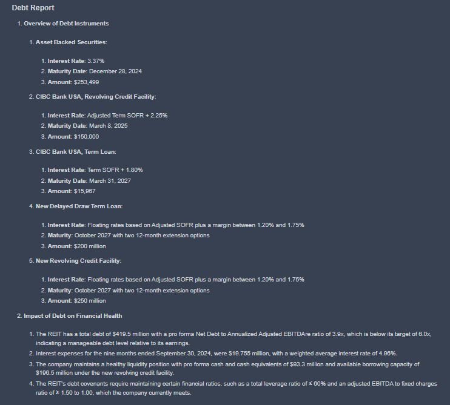
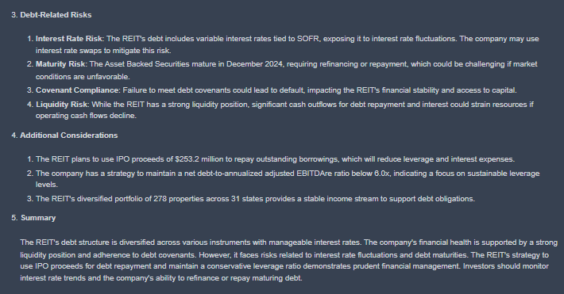

# Creating and Seeing Reports

## Creating Reports

### How report is generated?

- To generate the reports for the criterion the criterion info along with ticker is passed to an AI agent
- We at koalagains have used langflow to create the AI Agents
- The AI Agent can be created using langflow or any other tool and than this AI Agent can be used using its URL and passing the the information in payload which contains:
  - ticker
  - reportKey
  - criterion
    - key
    - name
    - shortDescription
    - importantMetrics
    - reports
- Now this information is passed to the AI Agent and as a return the Agent generates a report and returns back to the platform.
- This report is than shown on the platform

### How Do AI Agent Works Here?

The AI Agents that we have made using langflow till now can be called using their URLs and giving them the payload which includes:

- ticker
- reportKey
- criterion
  - key
  - name
  - shortDescription
  - importantMetrics
  - reports

### Extraction

- The above data is in Json format so firstly it is converted to message form which is processable by different components in langflow
- Now the reportKey which comes in payload decides that what part of flow will run.

### SEC 10Q Data

- Also the in a while the SEC 10 Q data tool is being used to get
  - All financial statements
  - Criteria related information based on criterion key in the payload
- Output of the above two is combined in a single place

### Report Key

Now based on the reportKey one of the following occurs:

- If reportKey is `all` then the whole flow will run including performance checklist, important metrics and all specific reports
- If reportKEy is `performanceCheckist` the flow for performance checklist will run only
- If reportKEy is `importantMetrics` the flow for important metrics will run only
- If reportKEy is a specific report e.g `debt_information` the flow for the debt information report will run only

### Generation of Reports

- When this flow runs it generates a report which is either a text report or a visualization like pie chart etc
  - The above report type also comes from the payload where the criterion has reports which have specific reportType there

### Saving of the Reports

- After the generation of the reports these reports are saved into s3

## Seeing Reports

The full company report includes a spider chart that summarizes the criteria and scores based on performance checklist. The criterion is not just scored but also has detailed reports explaining the reasons behind each rating.

You can click on "See Full Report" to view and read the detailed report, similar to the one shown in the image. You can also use https://koalagains.com/public-equities/tickers/FVR/criteria/debt_and_leverage to read the detailed report.

