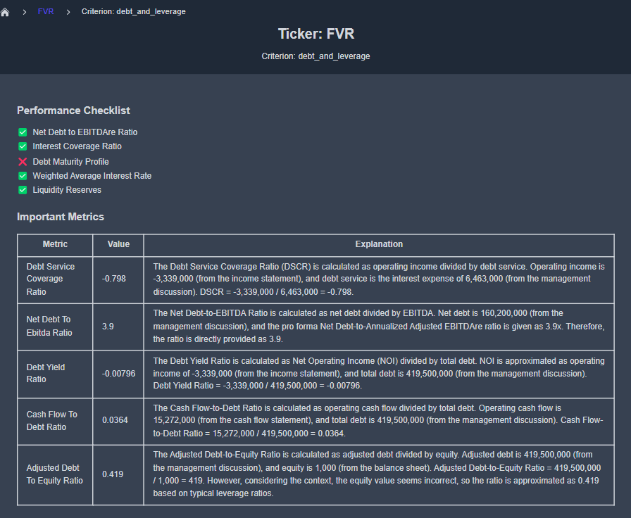
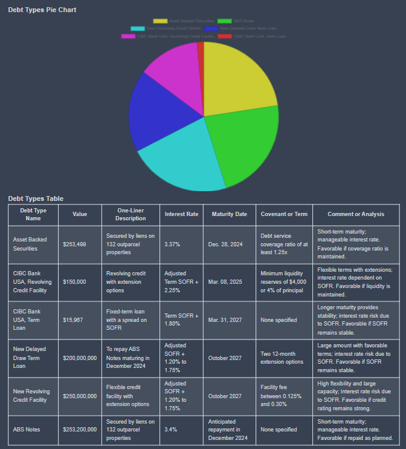

# Creating and Seeing Reports

KoalaGains uses AI-powered workflows to generate insightful reports based on specific evaluation criteria. These reports can be either text-based or visual (such as pie charts or spider charts) and are designed to help investors understand a company's performance in a clear and structured way.

## Creating Reports

### How Are Reports Generated?

To generate a report, the KoalaGains platform sends specific information—including the company’s ticker and evaluation criteria—to an **AI Agent**. These AI Agents are built using **LangFlow**, a tool for designing and deploying AI workflows.

Here's how the process works:

- A **payload** containing the following information is prepared:

  - `ticker`: the stock symbol of the company.
  - `reportKey`: identifies which type of report to generate.
  - `criterion`: includes the key, name, a short description, important metrics, and report types.

- This payload is sent to the AI Agent via its unique URL.
- The AI Agent processes the information and returns a generated report.
- The generated report is then displayed on the KoalaGains platform.

### How Do the AI Agents Work?

The AI Agents created using LangFlow can be accessed via a direct URL. Each time a report is needed, the system sends the prepared JSON payload to the agent.

**Inside the agent’s process:**

- The JSON data is converted into a message format that LangFlow components can understand.
- The value of the `reportKey` determines which part of the agent's flow will be triggered.

### Use of SEC 10-Q Data

In some cases, the agent also uses a tool to extract data from **SEC 10-Q filings**, including:

- Complete financial statements.
- Specific data related to the evaluation criteria, based on the `criterion.key` in the payload.

These two sets of data (financial statements and criteria-specific data) are then combined to provide a more complete report.

#### Role of the Report Key

The `reportKey` tells the system what kind of report to generate:

- If `reportKey` is **`all`**, the agent runs the full evaluation flow, which includes the performance checklist, important metrics, and all specific reports.
- If it is **`performanceChecklist`**, only the checklist is generated.
- If it is **`importantMetrics`**, only key metrics are included.
- If it refers to a specific report (e.g., **`debt_information`**), only that particular report is generated.

### Report Generation and Storage

Once the report is generated:

- It can be in text form or include visual elements like charts or graphs, depending on the `reportType` defined in the payload.
- The completed report is automatically **saved to an S3 bucket** (cloud storage) for future access.

## Viewing Reports

When viewing a company report, users can explore a **spider chart** that summarizes the company's performance across different criteria. Each criterion is scored based on its performance checklist, and detailed reports are available to explain the reasons behind each score.

To explore further, you can click **"See Full Report"** next to any criterion. This takes you to a detailed page that includes all relevant insights, visualizations, and metrics.

For example, you can visit a specific report like this one:  
👉 [Debt & Leverage Report for FVR](https://koalagains.com/public-equities/tickers/FVR/criteria/debt_and_leverage)

  
  
  

