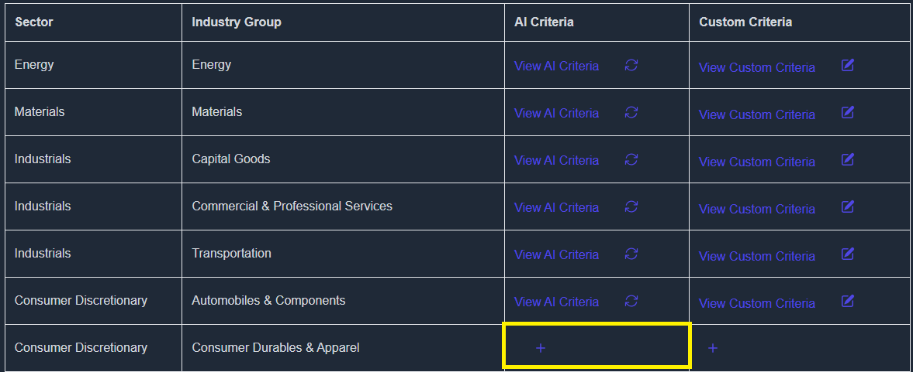
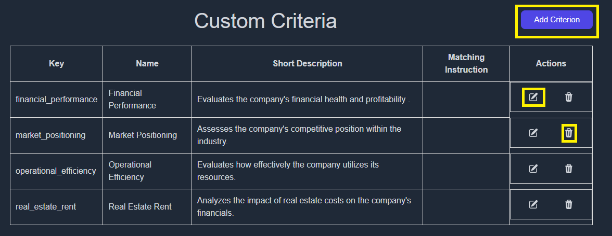

# Criteria

## Locate the sector and the industry group your company falls in

- If the criteria is already generated e.g if your company falls under | industries - transportation| proceed to last step else follow the steps below

## Generating the criteria for your company industry group

- Click on AI criteria and then write “confirm” to start generating the AI criteria

- Criteria will be generated in a few minutes.

## Customizing the AI generated criteria

- You may need to make changes to the AI generated criteria according to your needs.
- Click on the + sign under the “custom criteria” column once the AI content is generated
- (make change)

  

- The AI criteria will be copied and viewing it will show the following screen

  

- You can add an additional criterion to the ones created by AI by clicking on “Add criterion”
- You can edit the AI generated criterion by clicking on “edit” button under the actions column
- You can delete the AI generated criterion by clicking on “delete” button under the actions

  

- Once you made the changes, you need to set the “Matching Instruction” as well. This allows the AI to fetch information based on the criteria you explain here.

## Saving the evaluation criteria

- After customizing the criteria, do not forget to save the changes or else the changes will be lost

  

## Regenerating the evaluation criteria

- Headover to https://koalagains.com/public-equities/debug/ticker-reports/FVR (FVR will be replaced by your ticker) and click “Regenerate Matching Criteria”

  

- Once the regeneration has been completed you can view the content generated by clicking on drop drown in front of each factor.
- If any changes are required go back to step 3
