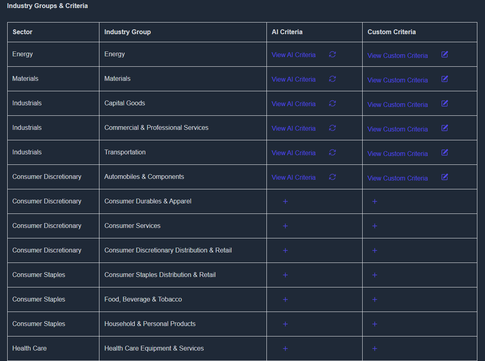
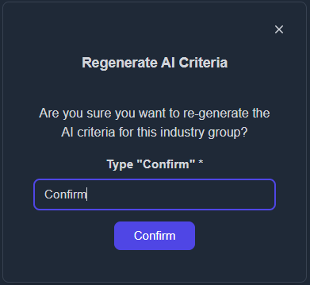
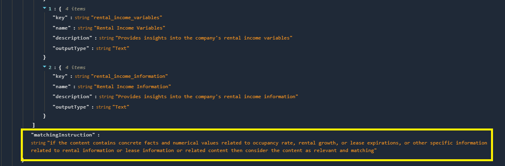
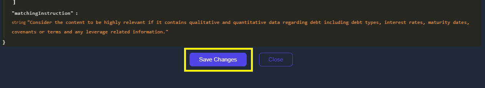

# Criteria

To generate a report for a company, the first step is to locate or create the appropriate **evaluation criteria** based on the industry group the company belongs to. KoalaGains provides built-in support for customizing these criteria to ensure accurate and relevant analysis.

## Step 1: Locate the Sector and Industry Group

- Begin by identifying the **sector** and **industry group** your company falls under.
- If evaluation criteria for that group already exist (e.g., **Industries → Transportation**), you can skip ahead to the final step.
- If criteria have **not** yet been generated for that group, follow the steps below to create them.

## Step 2: Generate Criteria Using AI

- Click on the **“AI Criteria”** button.
- A confirmation prompt will appear. Type **“confirm”** to start generating the evaluation criteria using AI.

- The criteria will be generated automatically within a few minutes.

## Step 3: Customize the AI-Generated Criteria

Once the AI-generated content appears, you can personalize it to better fit your needs.

- Click the **“+”** icon under the **Custom Criteria** column to begin customizing.

- The AI-generated criteria will be copied, and a new editable version will appear.

You now have the option to:

- **Add a new criterion** by clicking **“Add Criterion”**
- **Edit** any of the generated criteria by clicking the **“Edit”** button
- **Delete** unnecessary items by selecting the **“Delete”** button

Additionally, set the **Matching Instruction** to guide the AI on what information to extract. This ensures your custom criteria produce accurate and relevant results during report generation.

## Step 4: Save the Criteria

- After making all changes, click **“Save”** to ensure your custom criteria are stored.
- ⚠️ If you skip this step, your changes will be lost.

## Step 5: Regenerate Matching Criteria

If you’ve made changes or need to update the data, head to the following page:

👉 [https://koalagains.com/public-equities/debug/ticker-reports/FVR](https://koalagains.com/public-equities/debug/ticker-reports/FVR)  
_(Replace `FVR` with the ticker of your chosen company.)_

- Click **“Regenerate Matching Criteria”**.
- Once regeneration is complete, you can view the generated content by expanding each factor using the dropdown.
- If further changes are needed, return to the customization step.
