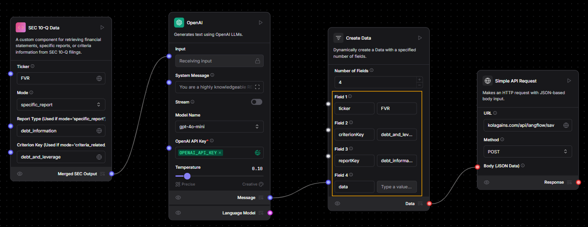

# Creating first report For Test Ticker

## Make the Flow

- Build the flow

  

- In first step we get the related SEC data fro the specific ticker, criterion and report type
- In second step we give the SEC data to OpenAI and also the prompt about the report Type to be generated
- In third step generated report is passed to next componnt as data which has this report content in data field
- The final body created by previous component is passed as body on post request to https://kolagains.com/api/langflow/save-report
