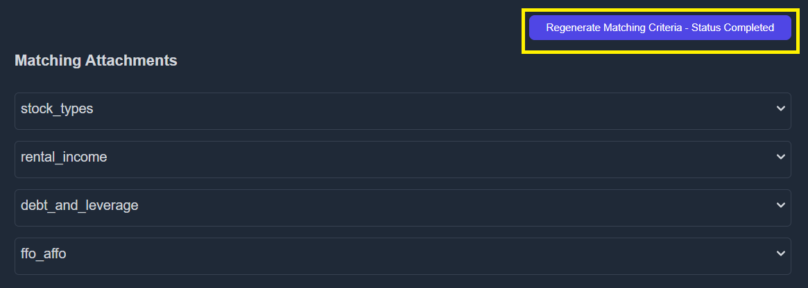
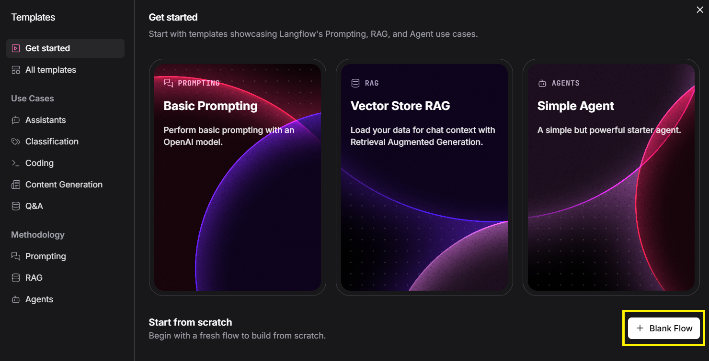
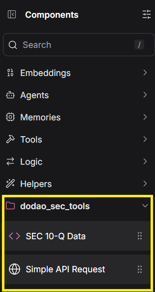

# How to Generate the performance checklist for your desired company

If you are not looged in as admin then go to [Authentication](./authentication.md)

## Step 1: Locate the sector and the industry group your company falls in


- If the criteria is already generated e.g if your company falls under | industries - transportation| proceed to step 5 else follow the steps below

## Step 2: Generating the criteria for your company industry group


- Click on AI criteria and then write “confirm” to start generating the AI criteria


- Criteria will be generated in a few minutes.

## Step 3: Customizing the AI generated criteria

- You may need to make changes to the ai generated criteria according to your needs.
- Click on the + sign under the “custom criteria” column once the AI content is generated
- (make change)

  

- The ai criteria will be copied and viewing it will show the following screen

  

- You can add an additional criterion to the ones created by AI by clicking on “Add criterion”
- You can edit the AI generated criterion by clicking on “edit” button under the actions column
- You can delete the AI generated criterion by clicking on “delete” button under the actions column

  

- Once you made the changes, you need to set the “Matching Instruction” as well. This allows the AI to fetch information based on the criteria you explain here.

## Step 4: Saving the evaluation criteria

- After customizing the criteria, do not forget to save the changes or else the changes will be lost

  

## Step 5: Regenerating the evaluation criteria

- Headover to https://koalagains.com/public-equities/debug/ticker-reports/FVR and click “Regenerate Matching Criteria”

  

- Once the regeneration has been completed you can view the content generated by clicking on drop drown in front of each factor.
- If any changes are required go back to step 3

## Step 6: Setting up Langflow for checklist generation

- Headover to langflow
  https://www.langflow.org/

  

- Click on “Blank Flow” to start building the flow.

  

- On the left section (1) there is a list of components that will be used to build your flow
- On the right section (2) there is the canvas where you can drag and drop components

## Step 7: Generating the Checklist

- Locate the dodao sec tools

  

- Build the flow

  

### Details of components


- Ticker contains the ticker of the company you are evaluating

- Criterion Key contains the name of the criterion. (use \_ instead of spaces)


- Mode lets you select the info you want to extract from the 10Q
- All_financials will fetch data of all financial statements
- Specific_report will fetch data of a particular financial statement
  Criteria_related_info will fetch the criteria related info.

## Step 8: Prompts for checklists:

- When you are creating the checklist for the first time you will use the prompt. Below exapmle is for criterion stock types you will have to make changes for your criterion accordinginly

```
Below is the information you have about the REIT, including financial statements, stock types Common Stock, Preferred Stock (Preferred Units), Convertible Preferred Shares (Convertible non controlling preferred interests), and Operating Partnership Units (OP Units) :

{data}

Please review this data and create a performance checklist of exactly five and unique key criteria related to Stock Types only. Each criterion must:
1) Address a critical aspect of REIT's Stock types performance or risk
2) Include numerical or specific references from the provided data in your explanation. never use par value as  reference .
3) Assign a score of 0 or 1 with clear logic on why it passes or fails.

Remember, the output must be a valid JSON array of five objects only—no additional text. Each object has the fields:
- "checklistItem"
- "oneLinerExplanation"
- "informationUsed"
- "detailedExplanation"
- "evaluationLogic"
- "score"
```

- Then the output of this prompt will be passed to the Open AI component where the propmpt will be set as

```
You are a highly knowledgeable REIT performance analyst. Your role is to evaluate the provided financial statements and stock types data to create five key performance criteria for assessing this REIT’s health and risk. Each checklist item must be scored 0 or 1 based on whether the REIT meets the criterion, with clear reasoning. Return the results only as a JSON list of 5 objects.

Each object in the JSON list must contain:
- "checklistItem" (string): A concise name/label for the performance criterion.
- "oneLinerExplanation" (string): A brief 1-line summary of why it matters.
- "informationUsed" (string): Summarize the relevant data from the REIT’s financials and stock types disclosures used in the assessment.
- "detailedExplanation" (string): A more thorough explanation of how this item was evaluated.
- "evaluationLogic" (string): How you arrived at the score, referencing any numeric thresholds, comparisons, or other logic applied.
- "score" (integer): 1 if the criterion is met, 0 if not met.

Do not include any additional commentary or text outside the JSON list. Output only the JSON array of 5 objects.

```

The abpve prompts are specific to REITS and criterion stock types so make changes accordingly
