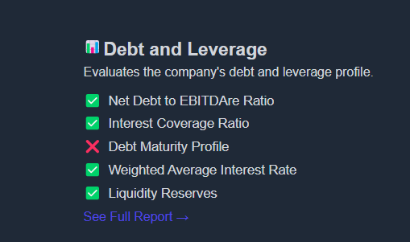

# Criteria

Each industry group requires a unique set of evaluation criteria to accurately reflect how companies operate and perform within that space. Let’s take the **REITs (Real Estate Investment Trusts)** industry group as an example.

For REITs, the following criteria are commonly used:

- **Debt and Leverage:** Since REITs often rely on borrowing to finance their operations and property acquisitions, it’s important to assess their debt levels. Evaluating leverage helps determine the company’s financial stability and exposure to risk.

- **FFO (Funds from Operations) & AFFO (Adjusted Funds from Operations):** These are key metrics for measuring a REIT’s real earnings. Unlike traditional profit figures, FFO and AFFO account for non-cash items like depreciation and adjust for capital expenditures. This gives a clearer view of the REIT’s true cash flow and financial health.

- **Rental Income:** As REITs earn most of their revenue from leasing properties, rental income is a crucial indicator of both profitability and asset performance. It reflects how well the REIT is utilizing its properties to generate revenue.

- **Stock Type:** The type of stock issued—especially **preferred stock**—matters in REIT evaluations. Preferred shares come with fixed dividend obligations, which can reduce the amount of cash available to **common shareholders**. Understanding the stock structure helps in evaluating future earnings and shareholder returns.

By focusing on criteria like these, KoalaGains ensures that the evaluation of REITs—and any other industry group—is tailored, accurate, and aligned with real-world financial practices.

Each evaluation criterion used in KoalaGains is supported by three key components that help users deeply understand and compare companies within an industry group:

## 1. **Performance Checklist Indicators**

These are specific indicators used to assess how well a company performs under a given criterion.  
For example, when evaluating **Debt and Leverage** for REITs, the checklist may include:

- Net Debt to EBITDAre Ratio
- Interest Coverage Ratio
- Debt Maturity Profile
- Weighted Average Interest Rate
- Liquidity Reserves

These indicators offer a quick snapshot of a company’s financial health in that particular area.

## 2. **Metrics**

Metrics are quantitative values used to compare companies operating in the same industry group.  
They help investors evaluate how a company stacks up against its competitors using standardized data points.

## 3. **Detailed Reports**

For each criterion, KoalaGains generates detailed reports that explain the data behind the evaluation. These reports provide in-depth insights, showing exactly how each score or rating is calculated and what it means for the company being analyzed.

Together, these three components ensure that every evaluation is thorough, transparent, and easy to understand—helping users make well-informed decisions.

