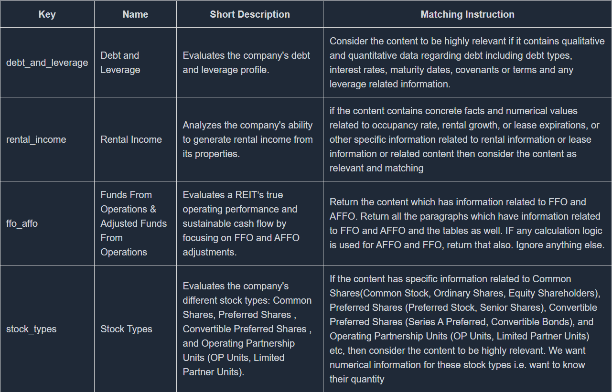

# Evaluation Criteria

Whenever evalauating a company(ticker) the criteria for the evaluation should be related to the industry group so that reports and graphs make sense to the investor while he is making a decison

So for that purpose the we define a criteria on the basis of which the data is collected and tha all these report or grpahs including spider chart,performance checklist, metrics ,text report and chart reports are generated based on that data collected so this evaluations criteria must be defined
correctly and carefully so that all these reports are correct and comprehensive

This evaluation criterion has attributes:

- Name - name of the criterion
- Key - same as name but all lowercase and underscores inplace of spaces
- Matching instruction - instructions to match the SEC filing attachment with the criterion
- Important Metrics - numerical metrics related to the criterion
- Reports - define the reports to be made for the criterion
- webhookUrl - webhook url of the AI agent

It can be edited for a specific idsutry group like REITS here by folling this [link](https://koalagains.com/public-equities/industry-group-criteria/real-estate/equity-real-estate-investment-trusts-reits/create)

