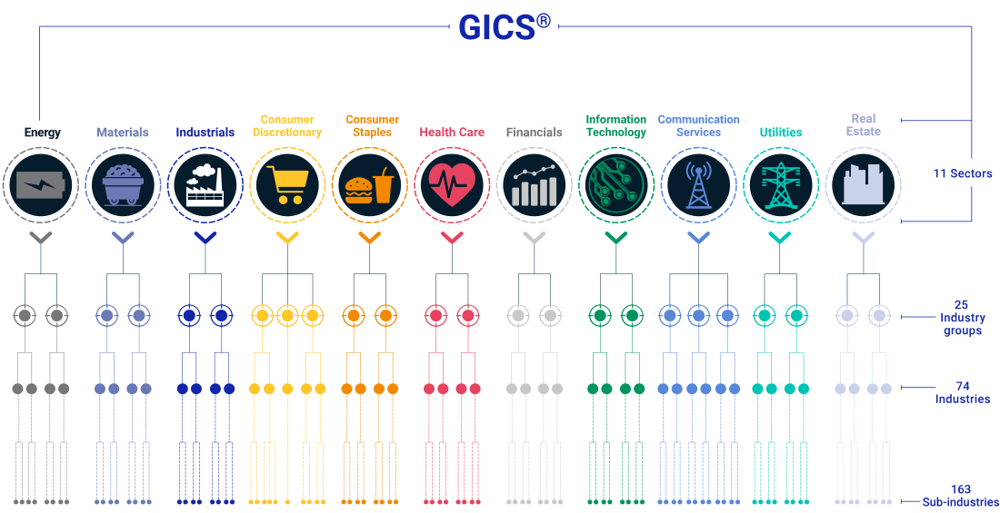

# GICS (Global Industry Classification Standard)

The **Global Industry Classification Standard (GICS)** is a widely accepted system for classifying companies into industries and sectors. It was developed by **MSCI** in collaboration with **S&P Dow Jones Indices**, and is used by major financial institutions around the world, including in indices like the S&P 500.

GICS organizes companies into the following structure:

- **11 sectors**
- **25 industry groups**
- **74 industries**
- **163 sub-industries**

This system helps bring consistency and clarity when grouping companies by the type of business they operate.

## Why GICS is Important for Evaluation

When analyzing a company, it’s important to compare it with others in the same industry. Each industry has unique characteristics, so using industry-specific criteria gives more accurate and relevant insights.

However, creating custom evaluation criteria for all **163 sub-industries** would require a huge amount of time and research. Even focusing on all **74 industries** is often too detailed and complex for practical use.

At KoalaGains, we use **industry groups** (25 in total) as the ideal level of classification. This level is specific enough to capture meaningful industry differences, but general enough to make the evaluation process efficient and scalable. It strikes the right balance between **accuracy and simplicity**.

## Why We Chose GICS at KoalaGains

- GICS is one of the most trusted and globally recognized classification standards for public companies.
- Its structure is **well-organized and easy to understand**, making it suitable for both beginners and experienced investors.
- GICS is commonly used in global financial markets, so using it aligns KoalaGains with widely accepted evaluation practices.

By adopting GICS, KoalaGains ensures that companies are evaluated within the right context—making comparisons more fair, consistent, and insightful.
