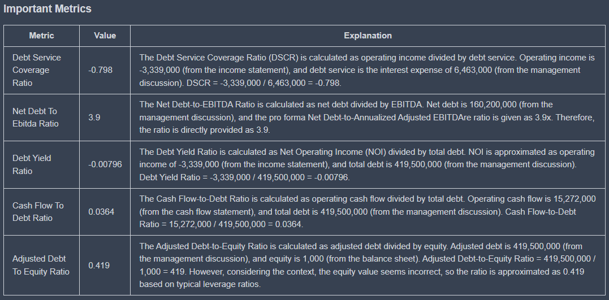

# Metrics

The metrics are an important repot Type offered by koalagains. The Metrics consist of some important metrics related to the specific criterion. osm eof its characteristics are explained below:

- Each metric has inputs:
  - name
  - formula for calculating
  - description
- based on these input outputs are
  - name
  - Value
  - Explanation
- The metrics are specifc for each criterion
- These metrics again help the investor to learn about the companies postion as he has direct inofrmation about important vlaues
- Then the investor can compare the companies based on these metrics because metrics are same for the companies falling in same industry group

