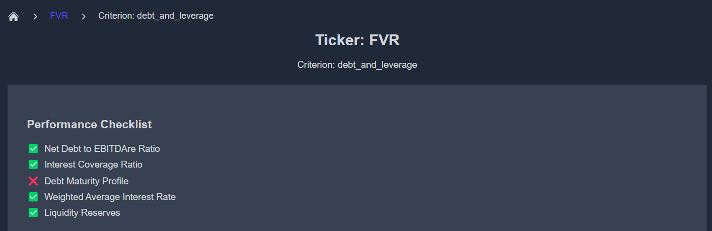

# Performance Checklist

The **Performance Checklist** is a key report type available on the KoalaGains platform. It works alongside the **Spider Chart** and plays a vital role in assessing a company’s performance within its industry group.

## What Does the Performance Checklist Do?

- The checklist evaluates how a company performs on a set of **five key indicators** under each **evaluation criterion**.
- These indicators are designed to reflect what is expected from a company operating in a specific **sector and industry group**.
- For each indicator, the company is given a **score of 1** if it meets the standard and a **score of 0** if it does not.

This method helps clearly show where a company is performing well and where it may be falling behind compared to others in the same industry.

## Why It Matters

- The **Performance Checklist** is the **foundation of the Spider Chart**—each score contributes directly to the overall rating shown visually.
- It provides a quick and structured way for investors to identify the **strong and weak areas** of a company.
- Because the checklist is built on **factual data**, it gives investors a reliable tool to base their decisions on.

This report type simplifies complex data into a straightforward scoring system, helping investors make better, faster comparisons.

