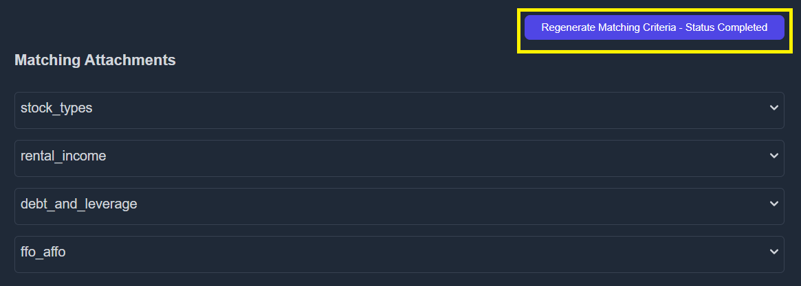
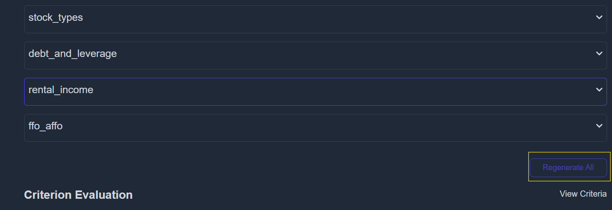
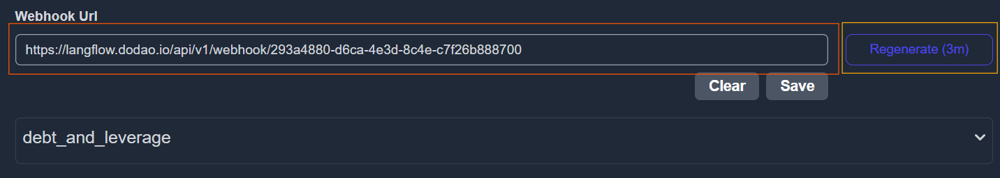

# How to regenerate criteria macthing,criterions and specifc report ,performance checklist, important metrics

If you are not looged in as admin then go to [Authentication](./authentication.md)

Go to [Debug Page](https://koalagains.com/public-equities/debug/ticker-reports/FVR). This link is for FVR you can replace it with your own ticker

## Regenrate criteria matching

- In case of criteria matching to regenerate click on the button below as shon in the image
  

## Regenerate criterions

- In case you want to regenerate all the criterions at once click on the button below as shon in the image
  

## Regenerate specific criteiron

- In case you want to regenerate a specific criteriion first off all enter its langflow Webhook URL in the box below
- Next step is to click save and then regenerate
  

## Regenerate checklist

## Regeneerate Important Metrics
