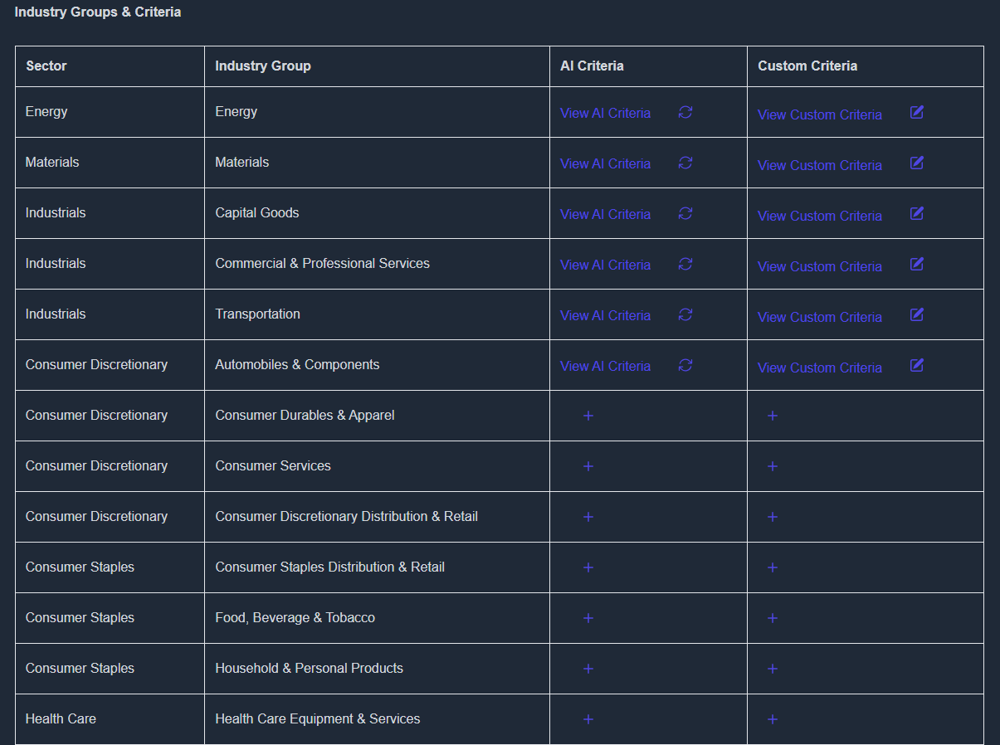

# Sectors and industry Groups - Evaluation Criteria

For a realistic and streamlined approach, we have chosen to evaluate companies based on industry groups, ensuring the criteria remain both specific and manageable. Different industry groups require distinct evaluation parameters, for instance, the criteria used to assess the Automobile & Components industry group are vastly different from those applied to the Consumer Services industry group. To accommodate these differences, we allow users to define custom evaluation criteria tailored to the industry group relevant to the company they want to analyze. Let's take a look on the table that we have for this purpose.

The table has different criteria for different industry groups, enhancing the accuracy and depth of evaluations.
