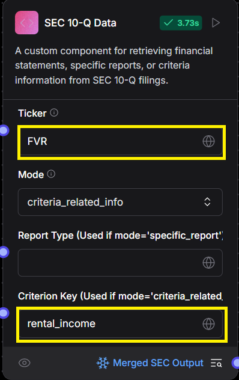

# Using SEC Tools in LangFlow

KoalaGains uses a custom SEC data extraction tool within LangFlow to collect financial data directly from a company’s **10-Q filings**. This tool helps the AI agent access accurate and relevant data for generating reports based on your selected evaluation criteria.

## Step 1: Locate the SEC Tools

Start by locating the **DoDAO SEC Tools** component in LangFlow.

This component is responsible for fetching data from the U.S. Securities and Exchange Commission (SEC) database.

## Step 2: Configure the Component

Once the tool is added to your flow, you’ll need to fill in a few fields to make it work properly:

- **Ticker**: Enter the stock symbol (ticker) of the company you want to analyze.
- **Criterion Key**: Enter the key for the specific criterion you're evaluating.
  > _Note:_ Use underscores (`_`) instead of spaces when entering the key (e.g., `debt_and_leverage`).

## Step 3: Select the Mode

The **Mode** option allows you to choose what kind of data to extract from the 10-Q filings:

- **all_financials**: Extracts data from all standard financial statements (e.g., balance sheet, income statement, cash flows).
- **specific_report**: Extracts data related to a specific report type you’ve defined.
- **criteria_related_info**: Fetches information directly linked to the selected evaluation criterion.

Using this tool, LangFlow pulls in structured SEC data that helps power more accurate and transparent company evaluations.
