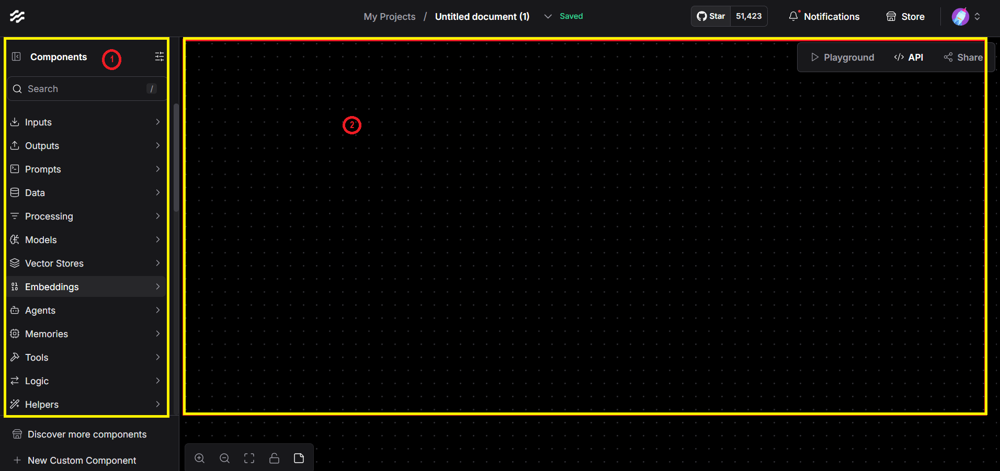

# Using Langflow

## Setting up Langflow

- Headover to langflow
  https://www.langflow.org/

  

- Click on “Blank Flow” to start building the flow.

  

- On the left section (1) there is a list of components that will be used to build your flow
- On the right section (2) there is the canvas where you can drag and drop components

## Make the Flow

- Build the flow

  

## Run and Test the Flow

- You can Run and test your flow either through inspecting the tools outputs or by using chat output to see the stuff in Playground
